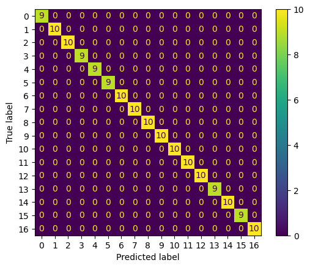

# Code des AI Hackathons by EintrachtTech, AWS & DFL

## Was war die Challenge?
Ziel: 17 verschiedene Posen aus DFL-Medienbildern mit Hilfe von einem selbst entwickelten KI-Modell klassifizieren.

Besondere Herausforderung: sehr kleiner Datensatz von ca 200 Bildern (also nur etwas mehr als 10 Bilder pro Pose)

## Information
Da die Bilder leider nur im Rahmen des Hackathons benutzt werden durften, sind hier leider keine Ergebnis-Bilder darstellbar.
Der hier veröffentlichte Code dient somit lediglich zur Vorstellung des konzipierten Workflows.

## Wie wurde die Challenge gelöst?
```text
• Data Augmenation (mehr Bilder zum Trainieren mit Image Flipping)
• Preprocessing Steps
     • Object Detection (Erkennung von Spielern und Bällen, da einige Posen davon abhängig waren, ob sie einen Ball beinhalten)
     • Keypoint Extraction (Erkennung aller Keypoints des Spielers, um die Koordinaten abzuspeichern)
     • Normalisierung (zuvor abgespeicherte Keypoints wurden entsprechend der Größe normalisiert, um nicht von der Bildgröße abhängig zu sein)
     • Messwerte-Berechnung (Berechnung von Abständen und Winkeln zwischen erfassten Keypoints)
• Modell-Training (Random-Forest-Modell, anhand von zuvor gespeicherter csv-Datei)
```

## Genutzte Modelle
```text
• selbst trainiertes Object Detection Model (basierend auf YOLOv11)
• yolo11x-pose
```

## Projektstruktur
```text
football-object-detection/
├── training/                
│   ├── image_mirror.py                # Data Augmentation
│   ├── preprocessing_keypoints        # Keypoint Extraction
│   └── Traing_Model.ipynb             # Jupyter-Notebook für das Training des Random-Forest-Modells
├── prediction/
│   ├── predict.py                     # gesamter Prediction-Prozess
│   └── predictions.csv                # Beispiel-Ergebnis csv-Datei
├── confusion_atrix.png                # Confusion-Matrix des trainierten Modells
├── training_approach.png              # Bildliche Darstellung des Training-Ansatzes
├── approach.png              # Bildliche Darstellung des gesamten Workflows
```
Die Datei predictions.csv bietet einen guten Einblick über die vom Modell prognostizierten Posen anhand von Beispiel-Bildern.


## Erreichtes Ergebnis:
Confusion-Matrix:



-> 100 % Accuracy

